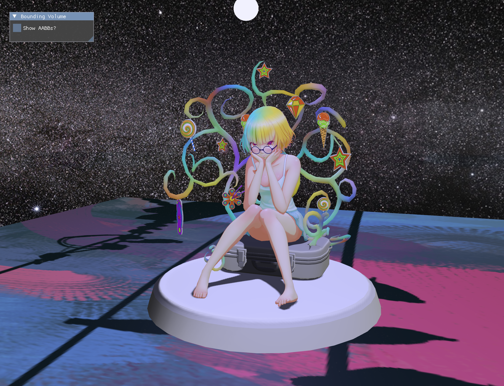
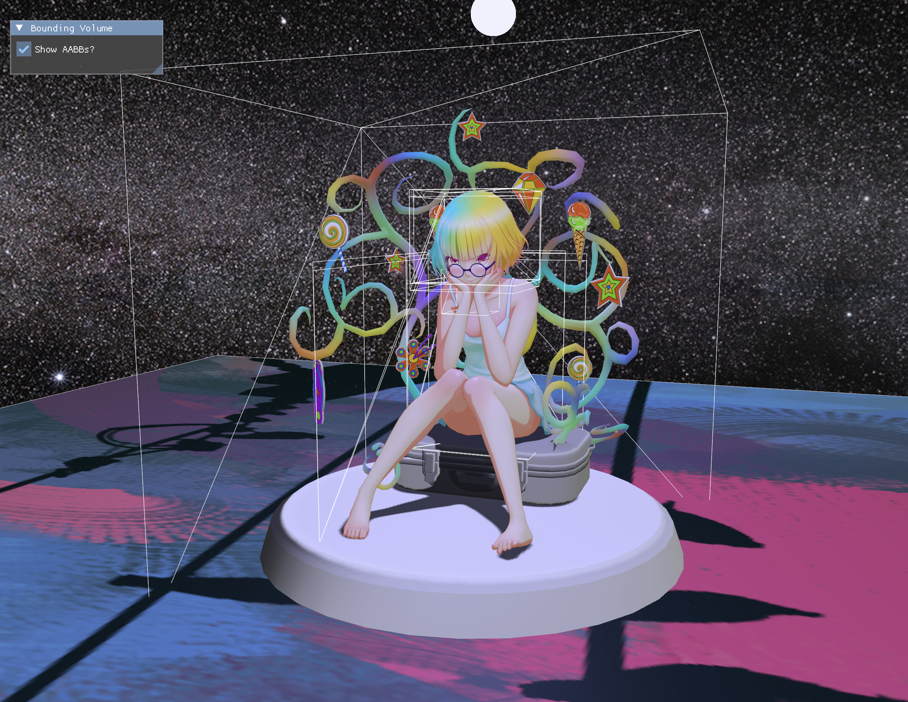

# Vulkan Engine

A hobby real-time renderer written in C++20 on top of Vulkan, running on macOS
through MoltenVK. Something fun I've been working on for almost a year now.



glTF scene with PBR shading, a point light, cubemap reflections, and a skybox.

## Bounding volumes

Toggling **Show AABBs?** draws the axis-aligned bounding box of every mesh in the
scene as a white wireframe, from the same buffer the acceleration structure is
built out of. The nested boxes are the individual meshes making up the model —
hair, glasses, the suitcase, each accessory — wrapped by the bounds of the whole.



This is the debug view for the GPU bounding volume hierarchy that's currently
being built out. Being able to see the boxes is what makes it possible to tell
whether the tree above them is right.

## Features

- **glTF loading** via fastgltf — meshes, materials, textures, node hierarchy
- **PBR shading** — Cook-Torrance specular with GGX distribution, Smith geometry,
  and Schlick fresnel, driven by glTF metallic/roughness maps
- **Point lights** with a dedicated billboard pass
- **Cubemap skybox** and environment reflections
- **Bindless textures** — a single descriptor array indexed per material
- **Object picking** (redoing) through an offscreen ID pass
- **4x MSAA** with resolve, using dynamic rendering rather than render passes
- **Dear ImGui** integration for runtime controls
- **GPU LBVH** *(in progress)* — morton codes, radix sort, radix tree
  construction, and bottom-up AABB propagation, following [Karras 2012](https://dl.acm.org/doi/epdf/10.5555/2383795.2383801)

## Building

Requires the Vulkan SDK, CMake, Ninja, and `glslang`. Local SDK paths live in
`envUnix.cmake`, which is gitignored — you'll need to create it.

```sh
git clone --recurse-submodules <repo>
./build.sh             # configure, SPIR-V, build, and launch 
```

`build.sh` runs the binary at the end, so it's a build-and-run script rather
than a build-only one. Shader compilation is separate; run `compile_shaders.sh`
yourself after editing anything in `shaders/`.

## Layout

| Path | Contents |
| --- | --- |
| `src/engine_*` | RAII wrappers — device, swapchain, renderer, pipeline, buffer, image, descriptor, window |
| `src/systems/` | Per-pass render systems — simple, point light, cubemap, bbox, offscreen |
| `src/bvh.{hpp,cpp}` | GPU LBVH construction |
| `src/engine_app.cpp` | Main loop, frame orchestration, picking |
| `shaders/` | GLSL sources and committed SPIR-V |
| `lib/` | Vendored dependencies — SDL, fastgltf, imgui, VMA, stb_image |

## Dependencies

SDL3, fastgltf, and Dear ImGui are git submodules. VMA, stb_image, and GLM are
vendored directly under `lib/`.

## Notes/Credits

Credit to these tutorials for their great help throughout my struggles:

- [Vulkan Game Engine Tutorial by Brendan Gaela](https://www.youtube.com/watch?v=Y9U9IE0gVHA&list=PL8327DO66nu9qYVKLDmdLW_84-yE4auCR)
- [Vulkan Tutorial](https://vulkan-tutorial.com/)
- [VkGuide](https://vkguide.dev/)
- [Learn OpenGL](https://learnopengl.com/)

**Note**: Claude was used to generate code for trivial matters like this markdown or
the CMake compilation files, but all C++ and shader code was done by hand (aside from
radix sort shader, where credit is given). Was also used for reference to answer questions.
